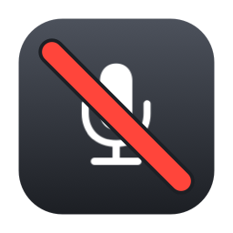

<p align="center">
  
</p>

<h1 align="center">OneMuteMic</h1>

<p align="center">
  Mute your Mac microphone with one click or one global hotkey.<br>
  一个点击，一个快捷键，随时让 macOS 默认麦克风闭麦。
</p>

<p align="center">
  Native macOS menu bar utility · Swift · macOS 13+
</p>

<p align="center">
  <a href="https://github.com/gongfpp/OneMuteMic/releases/download/v1.0.0/OneMuteMic-1.0.0.zip"><strong>Download v1.0.0</strong></a>
  ·
  <a href="https://github.com/gongfpp/OneMuteMic/releases/download/v1.0.0/OneMuteMic-promo.mp4">Watch demo video</a>
</p>

---

OneMuteMic 是一个轻量的 macOS 菜单栏工具，用来快速切换系统默认输入设备的静音状态。

不需要打开主窗口。左键点击菜单栏图标即可切换静音，也可以在任意应用中使用全局快捷键。它直接控制默认输入设备，因此使用同一输入设备的会议、语音和录音应用会同步受到影响。

## Features / 功能

- **一键闭麦**：左键点击菜单栏图标直接静音 / 取消静音。
- **全局快捷键**：默认使用 `⌃⌥M`，并提供多个预设组合。
- **自定义快捷键**：可以直接录入自己的组合键。
- **状态可见**：菜单栏图标会跟随当前麦克风静音状态变化。
- **自动跟随默认输入设备**：切换 Mac 默认麦克风后会自动重新读取设备状态。
- **反馈可选**：可开启 / 关闭提示音与系统通知。
- **原生轻量**：使用 AppKit、Core Audio 与系统全局快捷键能力实现，没有常驻主窗口。
- **本地运行**：不会读取或录制音频内容，当前代码也没有网络请求。

## Demo / 演示

仓库 Release 已附带一段实机宣传视频：

**[▶ Watch OneMuteMic demo](https://github.com/gongfpp/OneMuteMic/releases/download/v1.0.0/OneMuteMic-promo.mp4)**

后续如果要继续优化 README，建议再补一张 6–10 秒 GIF：只展示菜单栏图标、按下 `⌃⌥M`、图标从开启切到静音，再切回来。这样用户不点视频也能在 README 首屏看到核心交互。

## Install / 安装

### Download / 直接安装

下载最新公开版本：

**[Download OneMuteMic v1.0.0](https://github.com/gongfpp/OneMuteMic/releases/download/v1.0.0/OneMuteMic-1.0.0.zip)**

1. 解压 `OneMuteMic-1.0.0.zip`。
2. 把 `OneMuteMic.app` 拖入「应用程序」文件夹。
3. 启动应用，菜单栏出现麦克风图标。
4. 按 `⌃⌥M` 或左键点击菜单栏图标切换静音。

当前 v1.0.0 使用 ad-hoc 签名且尚未经过 Apple Notarization。如果 macOS 首次启动时拦截应用，可在 Finder 中右键应用选择「打开」，或前往「系统设置 → 隐私与安全性」确认打开。

### Build from source / 从源码构建

```bash
git clone https://github.com/gongfpp/OneMuteMic.git
cd OneMuteMic
open OneMuteMic.xcodeproj
```

在 Xcode 中选择 **OneMuteMic** Scheme 后运行，或使用：

```bash
xcodebuild \
  -project OneMuteMic.xcodeproj \
  -scheme OneMuteMic \
  -configuration Release \
  build
```

要求：

- macOS 13 Ventura 或更高版本
- Xcode（项目当前使用较新的 Xcode 工程格式）

## Usage / 使用

1. 启动 OneMuteMic 后，它会常驻 macOS 菜单栏。
2. **左键点击图标**：切换麦克风静音状态。
3. **右键点击图标**：打开设置菜单。
4. 默认全局快捷键为 **`⌃⌥M`**。
5. 在 **快捷键 → 自定义快捷键…** 中可以录入新的组合键。

菜单中还可以：

- 开启或关闭提示音
- 开启或关闭通知提醒
- 从预设快捷键中快速切换
- 打开 macOS 通知设置

## How it works / 工作方式

OneMuteMic 通过 Core Audio 控制 macOS 当前默认输入设备：

1. 优先使用设备原生的 **Mute** 属性。
2. 如果设备没有可写的 Mute 属性，则尝试通过输入音量实现静音。
3. 当系统默认输入设备发生变化时，重新检测新设备的能力和状态。

因此它不读取麦克风的音频数据，也不会把音频发送到任何地方。

## Compatibility / 兼容性

OneMuteMic 支持 macOS 13+。

大多数暴露标准 Core Audio 输入控制属性的内置麦克风、USB 麦克风和音频设备都可以工作。但部分虚拟音频设备、专业声卡或由厂商驱动完全接管的设备，可能不提供可写的系统静音 / 输入音量属性，此时应用会显示设备不支持静音控制。

在 macOS 26 及更新系统中，如果应用已经运行但菜单栏图标不可见，也请检查「系统设置 → 菜单栏」中 OneMuteMic 的显示权限。

## FAQ

### 为什么快捷键没有反应？

组合键可能已经被 macOS 或其他应用注册。右键打开 OneMuteMic 菜单，进入 **快捷键** 后换一个组合即可。

### OneMuteMic 会监听或录制我的声音吗？

不会。当前实现只读写 Core Audio 的设备控制属性，不读取音频 sample，也没有录音、上传或网络通信逻辑。

### 为什么某个麦克风无法静音？

不同音频设备暴露给 macOS 的 Core Audio 属性并不完全一致。OneMuteMic 目前依赖可写的 Mute 或输入音量属性；不提供这些属性的设备会被标记为不支持。

### 为什么第一次打开会被 macOS 拦截？

v1.0.0 目前是 ad-hoc 签名且未经过 Apple Notarization。正式对外分发时，应该改为 Developer ID 签名并完成 Notarization，减少 Gatekeeper 带来的安装摩擦。

## Development / 开发

项目目前保持很小的原生结构：

```text
OneMuteMic/
├── AppDelegate.swift
├── HotKeyManager.swift
├── MicController.swift
├── ShortcutRecorder.swift
├── StatusItemController.swift
└── main.swift
```

核心职责：

- `MicController`：检测并控制默认输入设备
- `HotKeyManager`：注册系统级快捷键
- `ShortcutRecorder`：录入自定义组合键
- `StatusItemController`：菜单栏 UI、状态和设置

## Roadmap / 下一步

- [ ] Developer ID 签名与 Apple Notarization
- [ ] 登录时自动启动
- [ ] GitHub Actions 构建检查
- [ ] Core Audio 关键逻辑的单元测试
- [ ] 更明确的设备兼容性诊断
- [ ] 中英文界面本地化
- [ ] README 实机演示 GIF
- [ ] 稳定后考虑自动更新

## Contributing

Issue 和 Pull Request 都欢迎。

如果提交设备兼容性问题，建议同时提供：

- macOS 版本
- Mac 型号
- 麦克风 / 音频设备型号
- OneMuteMic 显示的状态
- 是否能在 macOS 系统设置中直接调节该输入设备音量

## License

当前仓库尚未声明开源许可证。正式对外推广前建议明确添加许可证（例如 MIT、Apache-2.0 或其他适合项目目标的许可证）。
